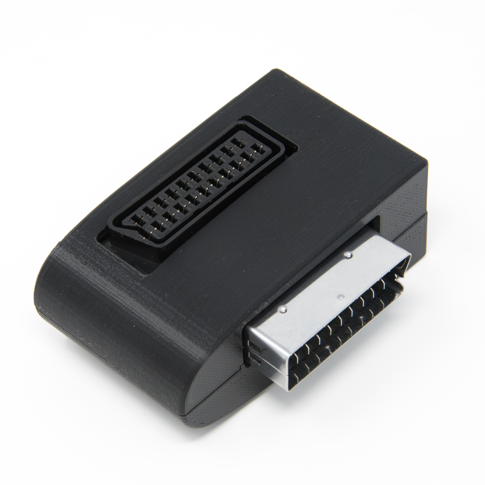

# 5X-Y-Z
If you are using the RetroTINK-5X Pro with a SCART input cable, this adapter rotates the SCART female plug 90° on the Y-axis and flips 90° on the Z-axis for a simple and clean cable management path in your entertainment system. The 5X-Y-Z also has a 3D printed shell. No lag, no added processing, just plug and play!

Fully assembled and QC tested 5X-Y-Z adapters can be [purchased here](https://kytor.com/store/product/5x-y-z/).

- Input: 1x [SCART]
- Outputs: 1x [SCART]

## Files Included
- **PCB Design Files** (DipTrace, Gerber)
- **3D Print Files** (STEP, STL, 3MF for Bambu Studio)
- **Fixture** (STL)
- **Photos**

## Parts Required
- [Male SCART Connector]
- [Female SCART Connector]
- [2x M3x10 Screws](https://amzn.to/43MXFzS)
- [RetroTINK-5X Pro](https://www.retrotink.com/product-page/5x-pro)

## Assembly
1. Solder SCART male edge connector in place. Optionally the fixture can be used.
2. Solder SCART female thru-hole connector in place.
3. Clean the board with isopropyl alchohol, then ultrasonic cleaning is recommended.
4. Screw the assembly with shell halves together with (2) of M3x10 screws.

## PCB Revision History
- Ver 1.0 - First production version.
- Ver 1.1 - Trace rerouting, no functional or fit/form/finish changes. Initial Open Source Release.

## Shell Revision History
- Rev 1 - First production version
- Rev 2 - Modified screw boss geometry
- Rev 3 - Modified connector trim geometry
- Rev 4 - Major geometry change for ease of FDM printing with minimal supports. Initial Open Source Release.

## License
This project is open-source under the [CC BY 4.0 (Attribution 4.0 International)](https://creativecommons.org/licenses/by/4.0/).

## Disclaimer
This project is provided "as-is" without any warranty, express or implied, including but not limited to warranties of merchantability or fitness for a particular purpose. No support is provided.

Amazon links are affiliates.